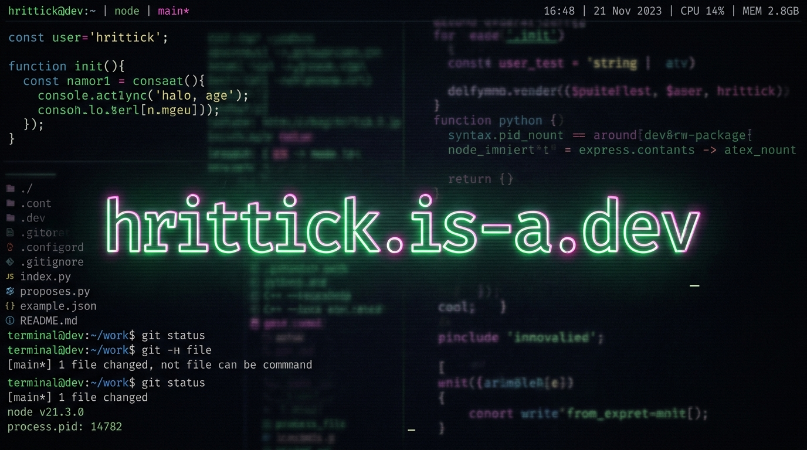

# hrittick.is-a.dev

[](https://hrittick.is-a.dev)
[](https://html5.org)
[](https://www.w3.org/Style/CSS/)
[](https://developer.mozilla.org/en-US/docs/Web/JavaScript)
[](https://opensource.org/licenses/MIT)

> A premium, interactive, full-screen developer terminal simulation hosted live on the `is-a.dev` domain. It showcases projects, math visualizers, and system utilities in a retro-modern CLI environment.

---

## 🚀 Key Features

*   🔊 **Web Audio Synthesizer:** Real-time synthesized mechanical keyboard click/clack sound effects. The script generates audio transients and sweeps on key strikes dynamically—completely offline, with zero asset download lag.
*   📺 **CRT Screen Emulation:** Toggleable linear-gradient scanline overlays, radial shadow vignetting, and a micro-frequency flicker overlay to simulate classic green-phosphor and CRT monitors.
*   🎨 **Visual Themes:** Includes five retro and modern terminal presets:
    *   `matrix` - Vintage green hacker console (default)
    *   `dracula` - Sleek dark purple developer aesthetic
    *   `nord` - Frosty arctic blue and grey
    *   `vaporwave` - Cyberpunk neon magenta and cyan
    *   `dos` - Retro IBM-PC BIOS blue-screen look
*   📐 **HTML5 Canvas Visualizers:** Fullscreen, high-performance math animations including:
    *   *Matrix Code Rain:* Cascading columns of binary, letters, and math glyphs matching the active theme colors.
    *   *Fractal Binary Tree:* A growing recursive branch system that sways in a simulated wind using trigonometry.
    *   *Lorenz Attractor:* A real-time chaotic chaos-theory trace plotting the famous Lorenz differential equations.
*   ⌨️ **True Shell Utilities:** Implements command history cycling (using Up/Down arrow keys) and path/command tab-autocomplete.

---

## ⌨️ CLI Shell Commands

Open the console at [hrittick.is-a.dev](https://hrittick.is-a.dev) and execute these shell utilities:

| Command | Arguments | Description |
| :--- | :--- | :--- |
| **`help`** | *None* | Lists all available shell utilities and formatting instructions |
| **`about`** | *None* | Prints a brief overview of my studies, interests, and profile |
| **`skills`** | *None* | Renders my technology map as a clean ASCII file tree graph |
| **`projects`** | *None* | Displays interactive cards detailing major projects (EdVault, Dotfiles) |
| **`contact`** | *None* | Lists clickable email, GitHub, and social network handles |
| **`math`** | `fib [n]`, `prime [n]` | Calculates mathematical sequences (with BigInt precision support) |
| **`math viz`** | `matrix`, `tree`, `lorenz` | Launches one of the fullscreen canvas math visualizers |
| **`theme`** | `[theme-name]` | Cycles or sets color themes (matrix, dracula, nord, vaporwave, dos) |
| **`crt`** | *None* | Toggles the retro cathode-ray scanline monitor filter |
| **`clicks`** | *None* | Toggles the mechanical keyboard keypress sound effects |
| **`clear`** | *None* | Clears the terminal screen buffer |
| **`gui`** | *None* | Opens my main visual React portfolio site in a new tab |
| **`exit`** | *None* | Closes the terminal session and redirects to my Vercel site |
| **`sudo`** | *None* | Enters administrator login mode (with hidden password typing) |

---

## 📂 File Structure

The project directory is structured cleanly to separate scripts, styles, and assets:

```text
.
├── assets/
│   └── header.jpg      # High-fidelity terminal banner graphic
├── styles/
│   └── style.css       # Layout variables, grid, CRT flicker & carets
├── scripts/
│   └── script.js       # CLI engine, click audio synth & canvas modules
├── .gitignore          # Git exclusion rules
├── CNAME               # GitHub Pages custom domain bind (hrittick.is-a.dev)
├── index.html          # HTML5 terminal wrapper & viewport entry point
├── LICENSE             # MIT license
└── README.md           # Documentation

```

---

## ⚙️ Under The Hood: Sound Synthesis

The mechanical click sound effects do not load external MP3/WAV files. Instead, they are synthesized in real-time using the browser's **Web Audio API**:

1.  **Transient Snap:** When a key is clicked, a short `bufferSource` containing 8ms of random white noise is generated, passed through a `bandpass` filter centered at 3500Hz, and decayed exponentially.
2.  **Key Tone:** A simultaneous `triangle` wave oscillator sweep drops from 260Hz to 130Hz within 30ms to create the low-mid resonance of a mechanical keycap bottoming out.
3.  **Special Keys:** Space, Enter, and Backspace automatically trigger lower-frequency sweeps (dropping from 140Hz to 70Hz) to simulate a wider keycap housing.

---

## 💻 Local Setup & Development

Since this project uses vanilla frontend technologies, you do not need to install NPM dependencies. Simply clone the repository and run a local server:

```bash
# Clone the repository
git clone https://github.com/hrittm/hrittm.github.io.git
cd hrittm.github.io

# Start a simple HTTP server (Python 3)
python3 -m http.server 8000
```
Then open `http://localhost:8000` in your web browser.

---
*Created with 💻, ☕, and 📐. Feel free to explore the console!*  
Thanks. ☘️
